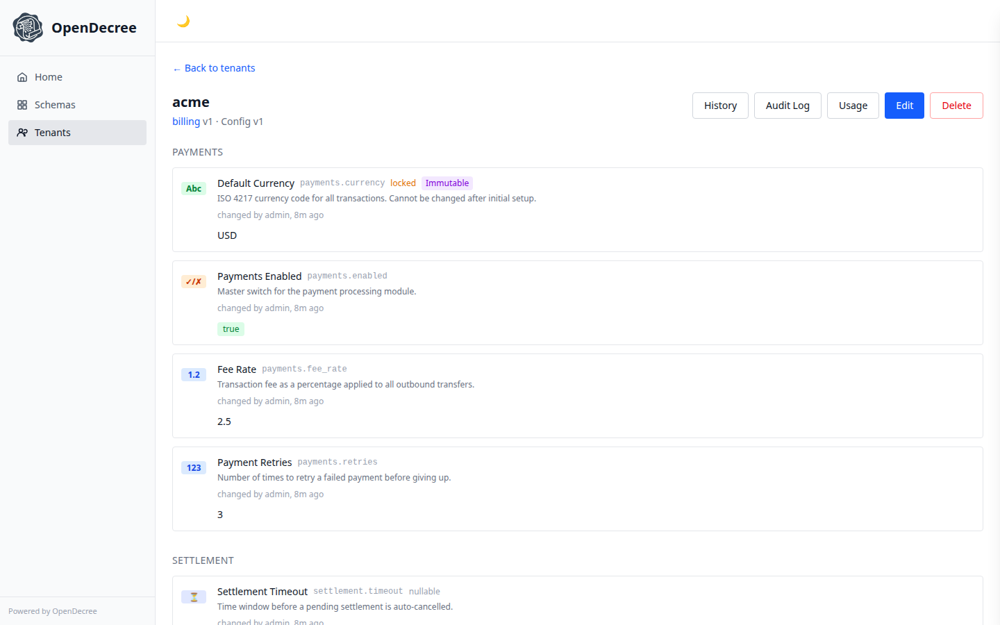

# OpenDecree Admin GUI

[](https://github.com/opendecree/decree-ui/actions/workflows/ci.yml)
[](https://github.com/opendecree/decree-ui/actions/workflows/codeql.yml)
[](LICENSE)
[](https://codecov.io/gh/opendecree/decree-ui)

A browser UI for [OpenDecree](https://github.com/opendecree/decree) — browse schemas, edit tenant config with validation and audit history,
and hand it to product or ops teams without giving them a terminal. Embeddable into your own
internal tools, with white-labeling so it can speak your domain's language instead of "schemas" and "tenants."

> **Alpha** — This project is under active development. UI, configuration, and behavior may change without notice between versions.



## Embedding and white-labeling

The UI ships in three layout modes (`VITE_LAYOUT_MODE`), so the same build can serve very different audiences:

- **`full`** (default) — schema management, tenant management, and config editing, for platform engineers running the whole system
- **`single-tenant`** — a config editor scoped to one tenant (no schema/tenant navigation), for handing to that tenant's ops team
- **`single-schema`** — one schema's fields plus the tenants on it, for teams that own a single config surface

See [docs/ui-modes.md](docs/ui-modes.md) for the full mode/persona breakdown.

On top of layout modes, `config/theme.json` feature flags can hide whole sections — e.g. set
`features.schemas: false` to keep non-developers out of schema editing — and `config/labels.json`
renames every visible string, so "Schemas" and "Tenants" can become "Services" and "Customers" to
match your domain. Details in [Customization](#customization) below.

## Development

```bash
# Install dependencies
npm install

# Start dev server (proxies /v1/* to localhost:8080)
npm run dev

# Run checks
npm run lint
npm run typecheck
npm test
npm run build
```

Requires a running OpenDecree server at `localhost:8080` (REST gateway).

## Environment Variables

| Variable | Description | Default |
|----------|------------|---------|
| `VITE_API_URL` | API base URL | `""` (same origin) |
| `VITE_LAYOUT_MODE` | `full`, `single-schema`, or `single-tenant` | `full` |
| `VITE_TENANT_ID` | Pre-selected tenant (single-tenant mode) | — |
| `VITE_SCHEMA_ID` | Pre-selected schema (single-schema mode) | — |

## Customization

All user-facing text and feature flags are configurable via two JSON files. Edit them before building to white-label the UI.

### Labels (`config/labels.json`)

Every string shown in the UI — page titles, button text, navigation items, empty states — is defined in this file. Override any key to rename concepts for your domain:

```json
{
  "nav.tenants": "Services",
  "tenant.singular": "Service",
  "tenant.plural": "Services",
  "tenant.create": "Create Service",
  "app.name": "MyCompany Config"
}
```

Only include the keys you want to change — defaults are used for the rest.

### Theme (`config/theme.json`)

Structural configuration:

```json
{
  "appName": "MyCompany Config",
  "logoUrl": "/my-logo.svg",
  "features": {
    "schemas": true,
    "audit": true,
    "configVersions": true,
    "fieldLocks": true,
    "configImportExport": true
  }
}
```

Set `features.schemas` to `false` to hide schema management entirely (useful when embedding for non-admin users).

### Applying customizations

Edit the files in `config/`, then rebuild:

```bash
npm run build
```

No code changes needed — the config files are read at build time.

## Stack

React 19, Vite, React Router, TanStack Query, Tailwind CSS, Biome, Vitest.

API types auto-generated from the OpenAPI spec via `openapi-typescript`.

## Questions?

Head to [OpenDecree Discussions](https://github.com/orgs/opendecree/discussions) — our community hub covers all OpenDecree repos.

## License

Apache License 2.0 — see [LICENSE](LICENSE).
